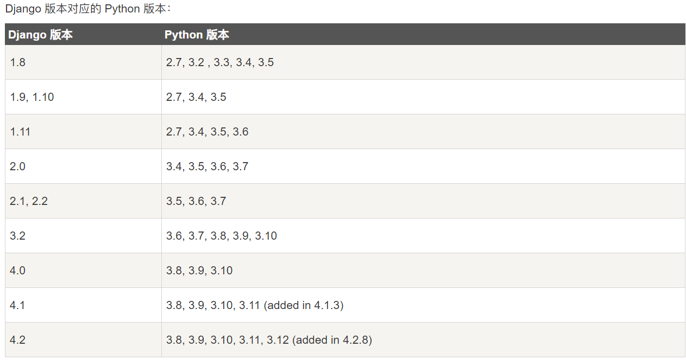

# Django

Django 是一个高级 python web 框架，用于快速开发可维护和可扩展的 Web 应用程序。

## 安装

### 安装python

作为一个python网络框架，Django需要python

### 设置数据库

### 安装Django



### 验证

若要验证Django是否能被python识别，可以在 shell 中输入 `<span class="pre">python</span>`。 然后在 Python 提示符下，尝试导入 Django：

```
>>> import django
>>> print(django.get_version())
5.0
```

## 说明

`models.py `文件是用来**定义数据模型**、**字段定义**、**关系定义**、**元数据**、**查询集**、**ORM映射**、**迁移管理等**

eg:

```
from django.db import models

# Create your models here.

# 角色信息
class Role(models.Model):
    # 名称
    name = models.CharField(max_length=100)
    # 内容ID（米哈游的ID）
    content_id = models.CharField(max_length=100)
    # 模板id（米哈游的）
    template_id =  models.CharField(max_length=255)
    # 描述
    description = models.CharField(max_length=999)
    # 头像
    icon_url = models.CharField(max_length=255)
    # 星级
    star = models.IntegerField()
    # 主题色
    theme_color = models.CharField(max_length=100)
    # 头像 - pc
    avatar_pc = models.CharField(max_length=999)
    # 头像 - 移动端
    avatar_mobile = models.CharField(max_length=999)
    # 属性集合
    attrs = models.CharField(max_length=999)
  
# 武器信息
class Weapon(models.Model):
    # 名称
    name = models.CharField(max_length=100)
    # 内容ID（米哈游的ID）
    content_id = models.CharField(max_length=100)
    # 模板id（米哈游的）
    template_id =  models.CharField(max_length=255)
    # 描述
    description = models.CharField(max_length=999)
    # 头像
    icon_url = models.CharField(max_length=255)
    # 星级
    star = models.IntegerField()
    # 分类
    category = models.CharField(max_length=100)
    # 图片
    image = models.CharField(max_length=999)
    # 富文本描述
    rich_text = models.CharField(max_length=999)
    # 属性
    attrs = models.CharField(max_length=999)

#圣遗物信息

class Equipment(models.Model):
    # 名称
    name = models.CharField(max_length=100)
    # 内容ID（米哈游的ID）
    content_id = models.CharField(max_length=100)
    # 模板id（米哈游的）
    template_id =  models.CharField(max_length=255)
    # 描述
    description = models.CharField(max_length=999)
    # 图片
    icon_url = models.CharField(max_length=255)
    #基础信息
    rich_base_info = models.TextField()


```

`urls.py `文件是在URL请求和处理该请求的视图函数之间建立一个对应的关系，可以视为一个URL请求映射表。这种映射关系是通过正则表达式或者路径函数实现的，它允许开发者自定义URL的模式，并将这些模式与特定的视图函数关联起来。

eg:

```
from django.urls import path

from . import views

urlpatterns = [
    path("", views.index, name="index"),

    path("roles", views.roles, name="roles"),
    path("roles/detail/<int:id>", views.roles_detail, name="roles_detail"),
  
    path("weapons", views.weapons, name="weapons"),
    path("weapons/detail/<int:id>", views.weapons_detail, name="weapons_detail"), 

    path("equipments", views.equipment_list, name="equipments"),
    path("equipments/detail/<int:id>", views.equipment_detail, name="equipments_detail"), 


]
```

`views.py` 文件包含了响应各种请求的函数或者类，这些函数或者类通常被称为视图，他们处理来自用户的HTTP请求，并返回HTTP响应。主要功能有：接收并处理请求、调用模型和模板、返回响应、错误处理等

eg:

```
# Create your views here.
from django.http import HttpResponse
from django.template import loader
from wiki.models import Role, Weapon,Equipment

def index(request):
    return HttpResponse("Hello, world. You're at the wiki index.")

def roles(request):
    role_list = Role.objects.all()
    template = loader.get_template('role/role_list.html')
    context = { 'role_list': role_list }
    return HttpResponse(template.render(context, request))

def roles_detail(request, id):
    role = Role.objects.get(pk = id)
    template = loader.get_template('role/role_detail.html')
    # 将attrs的json字符串转换成数组
    # if json.type(role.attrs):
    # role.attrs = json.loads(role.attrs)

    context = { 'role': role }
    return HttpResponse(template.render(context, request))

def weapons(request):
    weapons_list = Weapon.objects.all()
    template = loader.get_template('weapons/weapons_list.html')
    context = {'weapons_list':weapons_list}
    return HttpResponse(template.render(context,request))

def weapons_detail(request,id):
    weapon = Weapon.objects.get(pk = id)
    template = loader.get_template('weapons/weapons_detail.html')

    context = { 'weapon':weapon}
    return HttpResponse(template.render(context,request))

def equipment_list(request):
    equipments_list = Equipment.objects.all()
    template = loader.get_template('equipments/equipments_list.html')
    context = {'equipment_list':equipments_list}
    return HttpResponse(template.render(context,request))

def equipment_detail(request,id):
    equipment = Equipment.objects.get(pk = id)
    template = loader.get_template('equipments/equipments_detail.html')

    context = { 'equipment':equipment}
    return HttpResponse(template.render(context,request))
```
