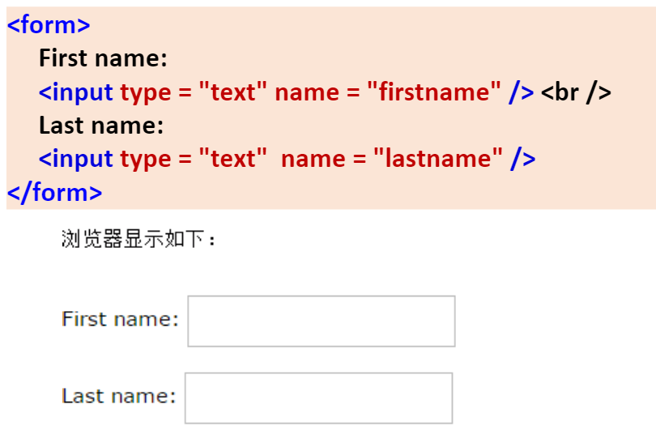
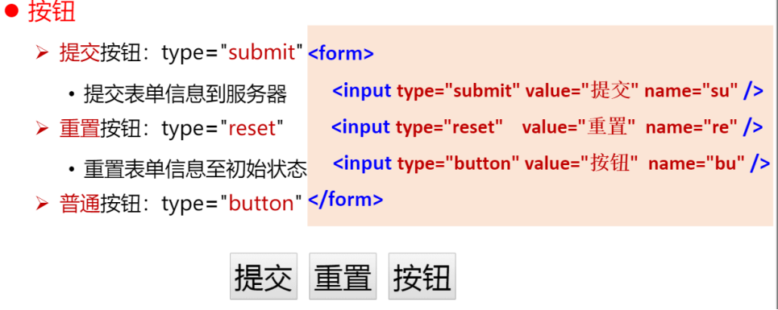

# web开发与应用

## 第一章 web开发与应用

1）URL（Uniform Resource Locator 统一资源定位符）

---互联网上标准资源的地址。

---例：

•http://www.baidu.com/

•http://tech.sina.com.cn/it/2015-01-14/doc-iavxeafr9972646.html

----组成部分：协议、服务器地址（域名）、资源路径

•**http:***//tech.sina.com.cn/***it/doc-iavxeaf46.html**

**协议**、*服务器地址（域名）*、**资源路径**

---

2）1.***B/S架构（Browser/Server）***

=通过浏览器访问的网络应用程序。

=典型应用：

•师大官网、网页版微博、网页版京东 …

2.***C/S架构（Client/Server）***

=通过客户端应用软件访问的网络应用程序。

=典型应用：

•淘宝App、QQ、微信 …

---

3）**B/S架构**

**优点：**

==>*无需安装特定客户端程序通过URL访问*

==> *跨平台能力* （Windows、Linux、Android、IOS…）

==>*无缝升级，客户端免维护*

**缺点：**

==>*不能直接使用客户端硬件资源，用户体验单一*

**C/S架构**

**优点：**

==>*能充分应用客户端硬件资源，响应*

*速度快，可构建大型3D效果应用*

==>*信息安全控制能力强*

**缺点：**

==>*需要安装特定客户端程序*

==>*针对不同平台需开发不同版本*

==>*升级应用须重新安装*

---

# 关于HTML

## html简介

*HTML：Hyper Text Markup Language*

==>超文本标记语言

==>HTML 不是一种编程语言，而是一种**标记语言**

==>标记语言是一套**标记标签**，HTML 使用标记标签来描述网页


---

==>HTML 标记标签通常被称为 **HTML 标签**，它是由**尖括号包围的关键词**，如 `<html>`


---

## HTML 标签三要素

学习 HTML 标签的三个要点

==>**词汇**（标签）

==>**语法**（标签的使用规定）

==>**语义**（浏览器“理解”的标签含义）

---

## html标签

1）词汇：`<html>`……`</html>`

2）语法：1.**成对出现**，分别写在文件内容的开始位置和结束位置，所有的网页标签都写在 `<html>` `</html>`之间。    

    2.**合理嵌套**。

3）语义：定义整个 HTML 文档，表示其中的内容为HTML语言。

---

### 关于<`head`>标签

1）词汇：`<head>`……`</head>`

2）语法：紧跟在 `<html>` 后面，并处于 `<body>` 标签之前。

3）语义：定义文档的头部，是所有头部元素的容器。包含网页的**基本相关信息**，比如文档的标题、元信息等。不直接显示在网页内容上。

---

### 关于<`body`>标签

1）词汇：`<body>`……`</body>`

2）语法：在 `</head>`标签之后，在 `</html>`标签之前。

3）定义文档的主体，即**网页显示的主要内容**。包含文本、超链接、图像、表格和列表等等。

---

### 标签分类

标签的分类

==>**双标签(代表标签作用范围)**：由“开始标签”和“结束标签”两部分构成。结束标

签比开始标签多了一个“/”（比如 `<body></body>`），***必须成对使用***。

==>**单标签(无需表达范围，仅在标签出现处有效)**：在开始标签中进行关闭，即以开始标签的结束而结束

（比如 `<meta/>`）。

==>>HTML **元素**指的是从开始标签到结束标签的所有代码

---

### 标签书写规范

标签与标签之间是可以**嵌套**的，但先后顺序必须保持一致

==>如：`<div>`里面嵌套 `<p>`，那么 `</p>`必须放在 `</div>`的前面。

<div> <p> 科学百科 </p> </div>

lHTML 标签**对大小写不敏感**

==>`<H1>`等同于 `<h1>`，但**建议统一规范小写**。

---

### 标签属性

HTML 标签可以拥有属性 ——为 HTML 元素提供附加信息

==>属性书写形式：**name = "value"** （即名称/值对）

==>属性书写位置：**开始标签**

==>不同标签具有**不同属性**

---

### 网络元素

==>**网页元素**是指构成网页的各项内容。

Eg:**文字、超链接、列表、图片 . . .**

---

### 标题标签

标题—— 在 HTML 文档中，一篇文章往往需要标题

==>`<h1>`...`</h1>`   h1-h6

==>代码：

```html
<h1>This is heading 1</h1>
<h2>This is heading 2</h2>
<h3>This is heading 3</h3>
<h4>This is heading 4</h4>
<h5>This is heading 5</h5>
<h6>This is heading 6</h6>
```

在浏览器中,标题**独占一行**。

效果:


---

### 段落标签

段落—— 网页中显示一段文字

==>`<p>`...`</p>`

==>代码:

```html
<body></body>
```

---

### 图片标签

图片—— 网页中显示一张图片

==>``

==>属性：

`src` : 指明存储图像的位置 图片的路径

`alt` : 为图片添加替换文本

``

---

#### 图片路径

1)**绝对**路径

==>***本机***绝对路径：从盘符开始的完整路径。

•e:\my_site\web\image\b.png

==>***网络***绝对路径：网络可访问地址。

•http://www.a.com/image/b.png

==>优点：真实路径，定位清晰。

==>缺点：本机绝对路径长，容易出错；

   如果站点文件夹被移动，就需要重新修改路径。***不推荐使用本机绝对路径***。

2)**相对**路径

==>相对路径是指相对当前文件或目录的路径。

==>相对路径规则：

•图片和网页在***同级目录***     src="./图片名"

•图片在网页的***下一级目录***  src="目录名称/图片名"

•图片在网页的***上一级目录***  src="../图片名"

a.pngimage/b.png../c.png

==>优点：文件夹被移动，其内部文件的相对路径不变。

---

##### 注意事项

1)不要使用本机绝对路径，推荐使用相对路径

2)图片文件单独存放在一个文件夹中

3)图片文件夹与页面文件放在同一个目录下

---

### 超链接

超链接—— 从一个网页指向一个目标的链接关系

==> `<a href=“”>`...`</a>`

==>属性

•**href**：必选属性，规定链接目标==>**链接的目标 URL**

•**target**：在何处打开目标

 **_blank**：在新窗口打开

 **_self**：在当前窗口打开（默认）

==>代码

```html
<body>
这是一个超链接：
<a href = "demo1.html"><h2>HTML中的二级标题</h2></a>
<br/>
您也可以使用图像来作链接：
<a href = "http://www.baidu.com/"  target = "_blank">
      
</a>
</body>
```

---

### 列表

列表—— HTML 支持无序列表、有序列表

==>无序列表：是一个**没有前后顺序**的信息列表。

==>有序列表：是一个**有前后顺序**的信息列表。

Eg:

---

1）无序列表

==>无序列表使用 `<ul>` 标签，每个列表项使用 `<li>`标签。

==>每个列表项默认使用**粗体圆点**进行标记。

==>列表项内部可以使用段落、换行符、图片、链接以及其他列表等。

Eg:

2）有序列表

==>有序列表使用 `<ol>` 标签，每个列表项使用 `<li>`标签。

==>每个列表项默认使用**数字**进行标记。

==>列表项内部可以使用段落、换行符、图片、链接以及其他列表等。


---

#### 注意事项

1)文件的扩展名要以**.html** 或者**.htm** 结束。

2)文件名由**英文字母、数字或下划线**组成。

3)文件名中不要包含**特殊符号**，比如空格、$ 等，**不使用中文**。

---

### 编码规范

1)所有的标签**必须关闭**。

2)所有标签和其属性的名字都必须使用**小写**。

3)所有的标签都必须**合理嵌套**。

4)所有的属性**必须赋值**，所有的**属性值**必须用**引号**括起来。

---

## 表格

==>使用表格可以排列页面中的文本、图像以及各种对象。

1）表格代码

```html
<body>
<table border="1">
    <tr>
        <th>姓名</th>
        <th>年龄</th>
        <th>成绩</th>
    </tr>
    <tr>
        <td>李四白</td>
        <td>20</td>
        <td>100</td>
    </tr>
    <tr>
        <td>张三丰</td>
        <td>19</td>
        <td>80</td>
    </tr>
    <tr>
        <td>王小麻</td>
        <td>18</td>
        <td>89</td>
    </tr>
</table>
</body>

```

效果图：


---

2)表格相关标签

`<table></table>`

语法：

1.成对出现

2.表格的开始和结束位置

语义：定义一个“表格”

---

`<tr></tr>`

语法：

1. 成对出现
2. 嵌套于 `<table></table>`标签内

语义：定义表格中的“一行”

---

`<th></th>`

语法：

1. 成对出现
2. 嵌套于 `<tr></tr>`标签内

语义：定义“表头”（特殊的单元格）

---

`<td></td>`

语法：

1. 成对出现
2. 嵌套于 `<tr></tr>`标签内

语义：定义表格中的“一个单元格”

---

3)表格相关属性：

* border:表格边框的宽度（pixels）
* 单元格合并—— 跨列(colsplan)

```html
<body>
<table border="1" >
    <tr>
        <th colspan = "2" >姓名</th>
        <th colspan = "2" >日期</th>
   </tr>
    <tr>
        <th>姓</th>
        <th>名</th>
        <th>年</th>
        <th>月</th>
    </tr>
</table>
</body>
```

效果图：


* 单元格合并—— 跨行(rowspan)

```html
<body>
<table border="1">
    <tr>
        <th>失主姓名</th>
        <th>时间</th>
        <th>遗失物品</th>
    </tr>
    <tr>
        <td rowspan = "2" >诗羽小姐</td>
        <td>2023-6-30</td>  
 <td>应援棒</td>
</tr>
 <tr>
     <td>2023-8-1</td>
 <td>CD一张</td>
    </tr></table>
</body>
```

效果图：


---

## 表单

1）**表单是一个包含表单元素的区域**。表单元素是允许用户在表单中输入信息的元素。（比如：文本框、下拉列表、单选框、复选框等）

2）其作用是从访问网站的用户那里获得信息，是**用户向服务器传输数据的接口**。

---

### 表单标签

`<form></form>`

* 语法：

1. 成对出现
2. 表单的开始和结束位置

* 语义：定义一个“表单”

相关**属性**：

•action:规定向何处发送提交的表单数据。值：URL

•method:规定以何种方式将表单数据传送到服务器。值：get/post

==>***所有表单控件***都必须放在 `<form></form>`标签之间，否则用户输入的信息无法提交到服务器！

---

1）表单控件 `<input>`标签

- ***文本框***

==>当用户要在表单中键入字母、数字等内容时，就会用到文本框。

```html
<form>
     <input type = "text" name = "名称" value = "文本" />
</form>
```

1. type：当type = "**text**"时，输入框为文本输入框。
2. name：为输入框命名，以备后台程序使用。
3. value：为输入框设置默认值。(一般起到提示作用)

Eg:



---

* ***密码框***

==>当用户要在表单中键入密码时，就会用到密码框。

```html
<form>
     <input type = "password" name = "名称" value = "文本" />
</form>
```

1. type：当type = "**password**"时，输入框为密码输入框。
2. name：为输入框命名，以备后台程序使用。
3. value：为输入框设置默认值。(一般起到提示作用)

Eg:


---

在使用表单设计调查表时，为了减少用户的操作，推荐使用选择框。

HTML 中有两种选择框，即**单选框和复选框。**

* ***单选框和复选框***


---

* ***文件控件***

==>当 type 属性值为 file 时，用于文件上传。

```html
<form>
     <input type = "file" name = "files" />
</form>
```

效果图：


---

* ***按钮***

---

## 表单标签总结（一）

`<input>` 用于搜集用户信息，输入类型由类型属性（type）定义。


---

* 表单控件 `<textarea>`标签

多行文本域

==>标签：`<textarea></textarea>`

==>相关属性：

•rows：规定文本区内可见行数。

•cols：规定文本区内可见列数。

```html
<form>
      <textarea  name = "cat " rows = "3" cols = "30"> 
             The cat was playing in the garden.
      </textarea>
 </form> 
```

效果：


---

* 表单控件 `<select>`标签

**下拉列表**

==> `<select></select>` 元素定义下拉列表

==> `<option></option>` **定义待选择的选项**

==> 默认把首个选项显示为被选选项，可通过添加 selected 属性设置默认选项,可通过添加 selected 属性设置默认选项


---

## 表单标签总结（二）


### 音频标签

HTML5提供了 `<audio>`标签，以实现插入音频的功能。


`<audio>`标签的使用方法

==>在 HTML 指定位置插入 `<audio>`标签

==>使用属性、JavaScript 控制音频的行为

---

### 视频标签

HTML5提供了 `<video>`标签，以实现插入视频的功能。


`<video>`标签的使用方法

==>在 HTML 指定位置插入 `<video>`标签

==>使用属性、JavaScript 控制视频的行为git
