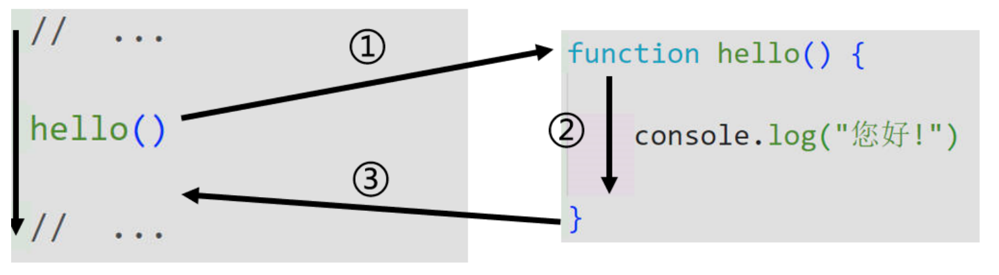

# 函数和事件处理

## 函数的定义和调用

### 函数的定义

代码设计的一个原则：可重复利用，相同功能的代码应该只定义一次。

函数：完成特定供能的一段代码；它可以实现可重利用性和任务分解的作用。


### 函数的要素

函数的名、函数的参数、函数的返回值


### 函数的分类

1.Javascript的内置函数

2.自定义函数


### 函数的定义

1.使用function关键字定义函数

```Javascript
ction test(arg1, arg2){
var a = 'bimbimbimbim';
console.log(a);
}
// 请注意，return语句和returnvalue语句都是可选的，即你有以下几种写法
//1.return a;
//2.return;
//3.不写return语句
```

2.使用函数表达式定义函数

```javascript
test1 = function(arg1, arg2){
// ......
console.log('一些操作');
// ......
// return 213;
// return;
// 不写return
}
```


### 函数的调用

1.在javascript中，调用函数有两种方式：

  1.直接调用函数：

**使用()运算符调用函数，可以向函数传递参数，函数可能含有返回值。**

  2.在事件中调用函数

在事件产生是，Javascript可以调用函数来响应事件。

    函数调用过程：




### 注意事项

定义函数时，函数名必须是合法的标识符，不能使用保留字当函数名，函数名要通俗易懂，最好可以通过函数名就能看出函数的功能。

设计函数时，最好每个函数只实现一个功能，方便函数的扩展、引用和维护。

为了便于引用，常用的或者先用的函数应该放在整个Javascript代码的前面。
