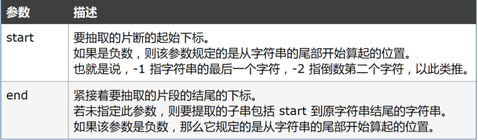

# 字符串和数组

## 字符串

+ 字符串变量是由双引号、单引号或反引号来声明；注意，反引号声明的是模板字符串，你可以向字符串中添加一些表达式，在添加时。你需要将表达式放在 `${表达式}`中。

使用方法：

```javascript
var age = 10;
var myStr = `这是一些信息，信息将要发送给${age<18?'未成年':'成年'}用户`
```

+ 字符串中的每个字符都有特定的位置，首字符从0开始。
+ 可以通过字符串变量的`length`属性获取字符串的长度，使用方法为：
  ```javascript
  var str = '123jh';
  console.log(str.length);
  ```

### 字符串方法

1.获取指定子串首次出现的下标，下标从0开始，如果没有，则返回-1.

```javascript
var str = '这是测试用字符串';
console.log(str.indexof('测试'));// 2
console.log(str.indexof('啊哈'));// -1
```

2.根据指定位置提取一段子串

通过字符串变量的`slice(start,end)`方法，提取出的子串从`start`开始到`end`结束，具体为左闭右开，即包括`start`下标对应的字符，但不包括`end`下标对应的字符，返回提取出的子串，注意，该方法不改变原字符串。




## 数组

### 定义数组

方式一：通过`[ ]`方式

例：`var arr1 = ['a','b','c'];`

方式二：通过new Array方式

例：`var arr2 = new Array('a','b','c');`

**数组中的元素可以是不同的数据类型。**

你可以通过数组的下标访问或处理数组元素：

```javascript
var arr = [1,2,3];
console.log(arr[1);// 2
arr[1] = '123';
console.log(arr[1]);// 123
```


可以通过数组的`length`属性获取数组长度，使用方法为：

```javascript
var arr = [1,2,3];
console.log(arr.length);// 3
```


### 遍历数组

你可以使用`for循环`遍历数组：

```javascript
var arr = [1,2,3];
for(var i = 0;i < arr.length;i++){
 // 依次处理每个数组元素
}
```
