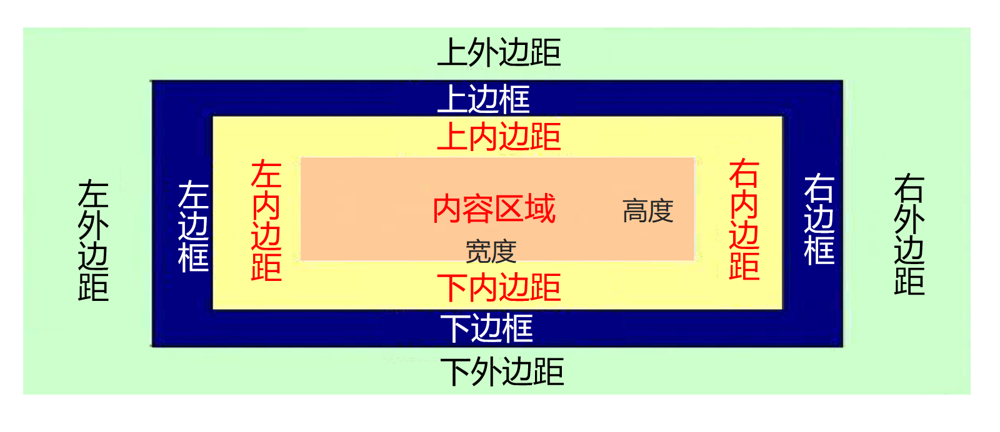

# 盒子模型

## 概述

### 概念

一个矩形区域，内容包裹在盒子中。盒子的堆叠与嵌套形成整个页面的内容排布。

### 作用

1.页面内容的容器

2.通过盒子与盒子的嵌套和堆叠实现布局

### 特征

从**内向外依次为**：**大小**（width、height），**内边距**（padding），**边框**（border），**外边距**

（margin）。



---

## 盒子模型的属性

### 大小

属性：width（宽度）、height（高度）。

功能：盒子模型内容区域是用于盛放元素的，通过width属性和height属性控制内容区域的宽度和高

度。请注意，**这里的width和height是css中的属性，不是元素的属性。**

### 边框

边框可以分为四部分：**上边框**、**右边框**、**下边框**、**左边框**，我们可以对这四个部分的宽度、线型、颜色

分别或一起进行调整。

控制边框的宽度：border-width属性

控制边框的线型：border-style属性

控制边框的颜色：border-color属性

如果我们想一次调整四部分，那么我们可以这样使用以上三种属性：

```css
border-width: 4px;
border-style: dotted;
border-color: rgba(200, 0, 0, 0.8);
```

如果我们想分别调整四部分的某种样式，那么我们可以使用这样的写法：

```css
/* 上下 左右 */
border-width: 4px 5px;
/* 上 左右 下 */
border-width: 4px 6px 5px;
/* 上 右 下 左 */
border-width: 4px 5px 6px 7px;
border-style和border-color同理。
```

如果我们想调整某个部分的某些样式，那么我们可以使用这样的写法：

```css
border-right: double 7px #bebebe;
border-bottom: 5px groove #bababa;
border-left: #acacac 4px dashed;
```

如果我们想一次性调整所有方向边框的某些样式，那么我们可以使用这样的写法：

```css
border: dotted 5px #ff0000;
```
