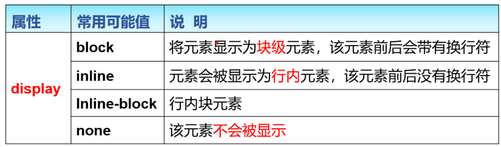

# 盒子模型

## 概述

### 概念

一个矩形区域，内容包裹在盒子中。盒子的堆叠与嵌套形成整个页面的内容排布。

### 作用

1.页面内容的容器

2.通过盒子与盒子的嵌套和堆叠实现布局

### 特征

从**内向外依次为**：**大小**（width、height），**内边距**（padding），**边框**（border），**外边距**

（margin）。


---

## 盒子模型的属性

### 大小

属性：width（宽度）、height（高度）。

功能：盒子模型内容区域是用于盛放元素的，通过width属性和height属性控制内容区域的宽度和高

度。请注意，**这里的width和height是css中的属性，不是元素的属性。**

### 边框

边框可以分为四部分：**上边框**、**右边框**、**下边框**、**左边框**，我们可以对这四个部分的宽度、线型、颜色

分别或一起进行调整。

控制边框的宽度：border-width属性

控制边框的线型：border-style属性

控制边框的颜色：border-color属性

如果我们想一次调整四部分，那么我们可以这样使用以上三种属性：

```css
border-width: 4px;
border-style: dotted;
border-color: rgba(200, 0, 0, 0.8);
```

如果我们想分别调整四部分的某种样式，那么我们可以使用这样的写法：

```css
/* 上下 左右 */
border-width: 4px 5px;
/* 上 左右 下 */
border-width: 4px 6px 5px;
/* 上 右 下 左 */
border-width: 4px 5px 6px 7px;
border-style和border-color同理。
```

如果我们想调整某个部分的某些样式，那么我们可以使用这样的写法：

```css
border-right: double 7px #bebebe;
border-bottom: 5px groove #bababa;
border-left: #acacac 4px dashed;
```

如果我们想一次性调整所有方向边框的某些样式，那么我们可以使用这样的写法：

```css
border: dotted 5px #ff0000;
```

### 内边距

### 外边距

属性：margin

功能：用于控制

使用方法：

```css
margin-top: 40px;
margin-right: 50px;
margin-bottom: 60px;
margin-left: 70px;
/* 四部分外边距相同 */
margin: 40px;
/* 上下 左右 */
margin: 40px 30px;
/* 上 左右 下 */
margin: 40px 30px 20px;
/* 上 右 下 左 */
margin: 40px 50px 60px 70px;
```

### 盒子模型的计算问题

***box = width/height + padding + border + margin***

## 块级元素与行内元素

HTML根据元素的显示特征，可以将元素分为以下两类

1. 块级元素：元素显示时独占一行，并具有盒子模型的特征。常见有： `<p>` 、 `<div>` 等。
2. 行内元素：在显示时通常不会以新行开始，横向排列，到最右端自动折行。常见有： `` 、

`<a>` 等。

### HTML容器元素

1. `div`：块级元素；作为内容或者其他元素的容器。
2. `span`：行内元素；作为内容或者其他元素的容器。

### HTML元素显示方式

属性：display

功能：使用 `display `属性可以调整HTML元素的显示方式，该属性的属性值为关键字。



使用方法：

```css
/* 不显示该元素 */
display: none;
```

## 补充

## 子元素选择器

与后代选择器相比，子元素选择器只能选择作为某元素子元素的元素。

使用方法：

```css
.myText>.myItem {
color: red;
}
```

## 关于透明度

属性：opacity；属性值是一个 0.0 到 1.0 范围内的数字值，这个数值既包含也代表通道的透明度，也就

是 alpha 通道的值。任何一个溢出这个取值区间的值，尽管有效，但会被解析为在取值范围内最靠近它

的值。

## 通用样式设置

通用选择器是功能最强大的选择器，它使用一个（*）号指定，它的作用是匹配html中所有标签元素。

为了保证页面能兼容多种浏览器，经常对HTML内的所有标签进行重置。

使用方法：

```css
* {
margin: 0;
padding: 0;
}
```
