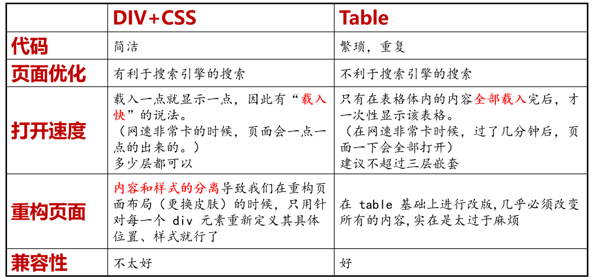
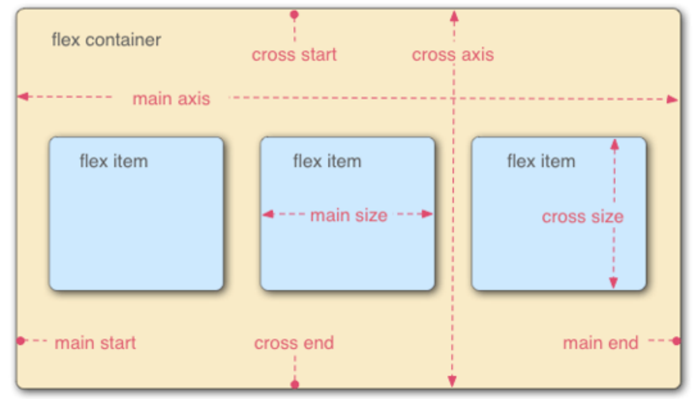
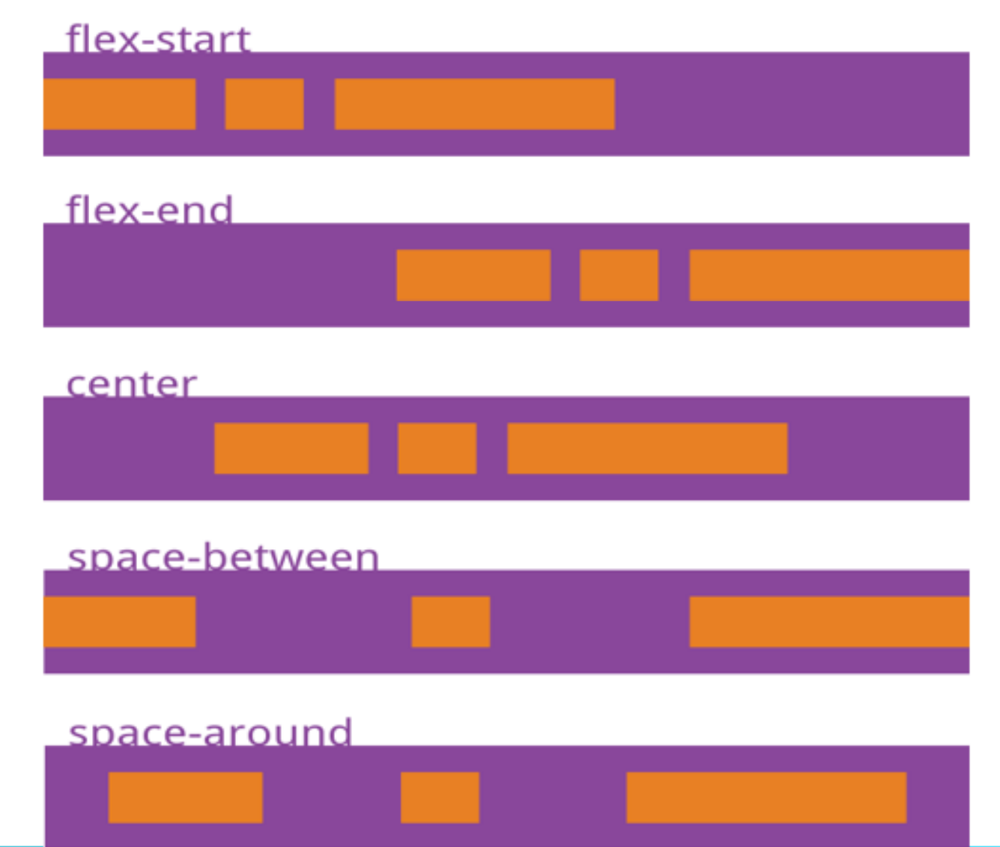
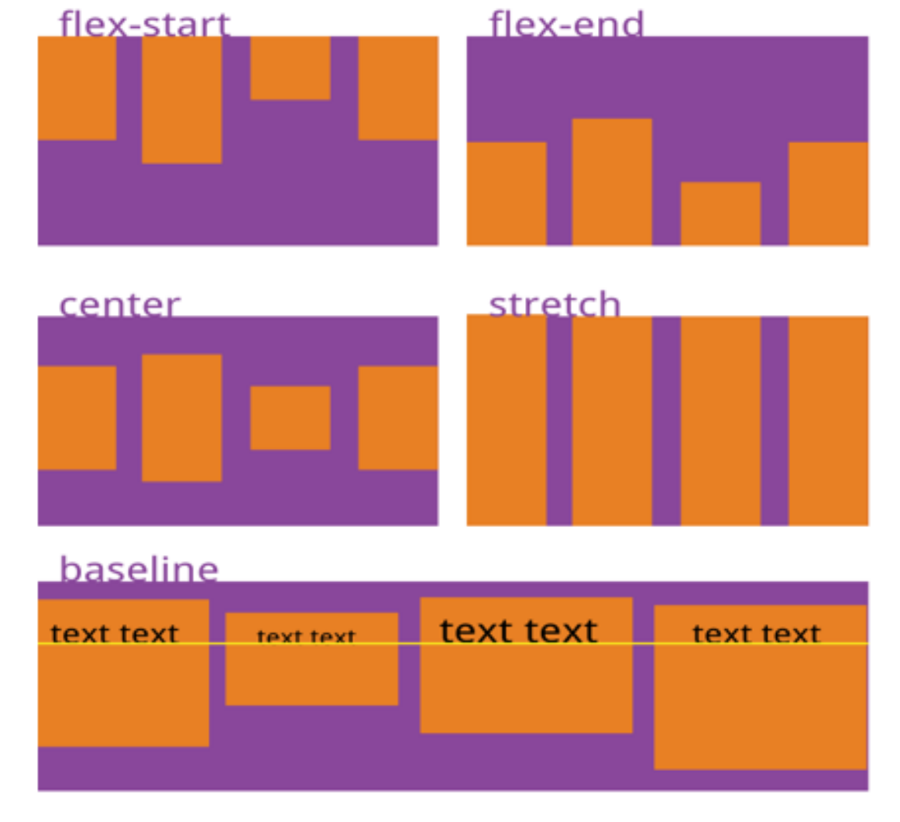

# 网页布局

## 概念

网页布局是指**网页内容在页面上所处位置的设计**；宗旨设计由整体到局部。

布局可以使用div标签，它相当于一个容器，可以将我们的网页分割成不同的部分，可以利用id或者class属性

### div+css与使用table进行布局的比较



## 布局方法

### 弹性布局

#### 流

元素流是浏览器在页面上摆放HTML元素的方法；块元素是从上向下流，各个元素的之间有换行符；行

内元素从左上方向右下方流。

#### 弹性布局的相关概念

弹性盒模型决定一个盒子在其他盒子中的分布方式以及如何处理可用的空间。



指定为flex布局的元素，称之为flex容器，简称容器；弹性盒子的子元素自动成为flex项目，简称项目；

**容器默认存在水平方向的主轴和垂直方向的交叉轴。**

#### 弹性布局的相关属性

1. `display`属性：当属性值为`flex`时，设置该元素为容器。
2. `flex-direction`：定义主轴的方向；它的属性值有 *`row`（主轴为水平方向且起点在左端）* 、 *`row-reverse`（主轴为水平方向且起点在右端）* 、 *`column`（主轴为垂直方向且起点在上沿）* 、 *`column-reverse`（主轴为垂直方向且起点在下沿）* 。
3. `flex-wrap`：规定 flex 容器是单行或者多行，同时主轴的方向决定了新行堆叠的方向；它的属性值

有 *`nowrap`（默认值。规定灵活的项目不拆行或不拆列。）* 、 *`wrap`（规定灵活的项目在必要的时候拆行或*

*拆列。）* 、 *`wrap-reverse`（规定项目在必要的时候以相反的顺序拆行或拆列。）* 。

4. `justify-content`：调整项目在主轴上的对齐方式；属性值有 `flex-start`*（主轴起点对齐）* 、 `flex-end`*（交叉轴起点对齐）* 、 `center`*（居中）* 、`space-between`*（两端对齐）* 、 `space-around`*（每个**项目两侧的间隔相等。故项目之间的间隔比项目与边框的间隔大一倍） 、* `space-evenly` *(每个项目两侧和项目与边框之间的的间隔相等)。*




5. `align-items`：规定项目在交叉轴上的对齐方式；属性值有 `flex-start`*（交叉轴起点对齐）* 、 `flex-end`*（交叉轴终点对齐）* 、 `center`*（居中）* 、 `baseline`*（项目第一行文字的基线对齐）* 、`stretch`*（元素被拉伸以适应容器。如果项目未设置高度或设为auto，将占满整个容器的高度）* 。




6. 关于居中：1. 如果你想让文字在某个元素中居中显示，你可以利用 `text-align` 属性使其在水平方向上居

中，再利用` line-height `属性（实际上是调整了行高等于元素内容区域的高度，而文字会在

每一行垂直方向上居中显示，最终呈现为在元素中垂直居中）使其在垂直方向上居中。

2. 利用外边距居中：`margin: 0 auto`。
3. 如果你想让子元素在某个元素中居中显示，你那么你可以利用弹性盒，具体使用方法如下：

   ```css
   .myContainer {
   display: flex;
   /* 主轴方向上居中 */
   justify-content: center;
   /* 交叉轴方向上居中 */
   align-items: center;
   }
   ```

7.项目属性：

1.`flex-grow`:定义项目的放大比例，当其值为`0`时，即为不放大；注意，如果项目之间的`flex-grow`存在不同，他们会进行不同比例的放大，最终呈现的效果是`flex-grow`属性值较大的元素看起来更大一些。

具体项目的主轴尺寸扩大规则如下：

    1.如果项目主轴方向尺寸之和小于容器区域主轴方向尺寸,则扩大；反之，则不扩大；

    2.首先，我们需要计算**系数**，系数计算方法**itemFG之和>1?1:itemFG之和**,设为**rat**；

    3.接下来，我们需要计算**剩余空间**，剩余空间为**PC-itemSize之和**，设为**x**；**用于瓜分的空间为x*rat**，设为**y**；

    4.然后，**每个项目扩大获得的额外尺寸为**，**（itemFG/itemFG之和）*y**；

    5.最后，**每个项目的实际的尺寸为原有尺寸+额外尺寸**。

2.`flex-shink`:定义了项目的缩小比例；当其值为0时，即为不缩小。

    具体项目主轴尺寸收缩规则如下：

    1.如果项目主轴方向尺寸之和大于容器区域主轴方向尺寸，则收缩；反之，则不收缩。

    2.首先，我们需要计算**系数**，系数计算方法**itemSh之和>1?1:itemSh之和**，设为**rat**;

    3.接下来，我们需要计算剩余空间，剩余空间为**itemSize之和-PC**，设为**x**；**用于瓜分的空间为x*rat**，设为**y**；

    4.然后，**每个项目收缩尺寸**为，**[(itemSh*itemSize)/(itemSh*itemSize之和)]*y**；

    5.最后，**每个项目实际的尺寸为原有尺寸-收缩尺寸**。

3.`flex-basis`:定义了在分配多余空间之前，项目占据的主轴空间

    `flex-basis`设置为`auto`，且元素设置了宽度吗？如果设置了，元素的大小将会置于设置的宽度。

    `flex-basis`设了为`auto`或`content`（在支持的浏览器中）？如果设置了，元素的大小为原始大小。

    `flex-basis`是不为`0`的长度单位吗？如果是这样，那这就是元素的大小。

    `flex-basis`设为了`0`？如果是这样，则元素的大小不在空间分配计算的考虑之内

4.flex：`flex-grow`，`flex-shink`和`flex-basis`的简写，默认值为 `0` `1` `auto`，后两个属性可选。

单值语法：值必须是以下之一：

    一个的有效值：此时简写会扩展为flex:1 0。

    一个的有效值：此时简写会扩展为flex:1 1.

    关键字`none`或者全局关键字之一。

双值语法：

    第一个值必须是一个`flex-grow`的有效值。

    第二个值必须是以下之一：

    一个`flex-shink`的有效值：此时简写会扩展为flex: 0。

    一个`flex-basis`的有效值：此时简写会扩展为flex：1。

三值语法：值必须按照以下的顺序指定：

    一个`flex-grow`的有效值。

    一个`flex-shink`的有效值。

    一个`flex-basis`的有效值。


### 定位
